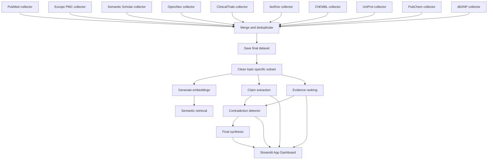

# Griffin Bio – Scientific Evidence Synthesis & Contradiction Workbench

This project builds a professional research database and RAG pipeline around biomedical queries.

It collects scientific data from 10 modular source collectors, merges and deduplicates them, filters by keywords, generates embeddings, and supports semantic graph retrieval, claim extraction, and contradiction detection.

## Pipeline



## Main Scripts

- `collector_registry.py` - central registry for source collectors and their output paths.
- `planner_agent.py` - builds the query plan, workflow sections, and edges.
- `retriever_agent.py` - wraps standard and graph retrieval.
- `claim_extractor_agent.py` - agent facade for claim extraction.
- `evidence_ranker_agent.py` - agent facade for evidence scoring.
- `contradiction_agent.py` - agent facade for contradiction analysis.
- `consensus_agent.py` - consensus analyst agent with multidimensional confidence logic.
- `eln_agent.py` - electronic lab notebook entry generator agent.
- `experiment_agent.py` - dynamic lab protocol and control planner agent.
- `verifier_agent.py` - citation verification loop and auditor agent.
- `build_dataset.py` - runs the full collection and merge pipeline and can target a subset of collectors with `--sources`.
- `collect_pubmed.py` - fetches PubMed papers with Entrez.
- `collect_pmc.py` - fetches Europe PMC papers.
- `collect_semanticscholar.py` - fetches Semantic Scholar papers.
- `collect_openalex.py` - fetches OpenAlex works.
- `collect_clinicaltrials.py` - fetches ClinicalTrials.gov trials.
- `collect_biorxiv.py` - fetches bioRxiv preprints.
- `collect_chembl.py` - fetches ChEMBL compounds.
- `collect_uniprot.py` - fetches UniProt protein mappings.
- `collect_pubchem.py` - fetches PubChem compound properties.
- `collect_dbsnp.py` - fetches dbSNP genetic variants.
- `clean_dataset.py` - filters papers by search keywords.
- `generate_embeddings.py` - creates sentence embeddings for cleaned papers.
- `retrieval.py` - searches the embedded dataset by semantic similarity.
- `claim_extractor.py` - extracts structured claims using Ollama.
- `evidence_ranker.py` - classifies papers by Oxford Levels of Evidence, extracts sample sizes, and assigns scores.
- `contradiction_detector.py` - identifies contradictions from extracted claims using pairwise LLM comparison.
- `final_synthesis.py` - synthesizes an advanced final report from claims, contradiction records, and evidence quality metrics.
- `app.py` - launches the premium Streamlit interactive web dashboard to visualize findings.

## Setup

Create and activate the virtual environment, then install dependencies:

```powershell
& .\venv\Scripts\Activate.ps1
pip install -r requirements.txt
```

Set required environment variables:

```powershell
$env:ENTREZ_EMAIL = 'your.email@example.com'
$env:SEMANTIC_SCHOLAR_API_KEY = 'your-semantic-scholar-key'
```

## Build the dataset

Run the full pipeline:

```powershell
python build_dataset.py --query "metformin breast cancer" --max-results 100 --run-filter
```

Run only a subset of collectors:

```powershell
python build_dataset.py --sources PubMed PMC --max-results 100 --run-filter
```

This produces:

- `dataset/pubmed.csv`
- `dataset/pmc.csv`
- `dataset/semantic_scholar.csv`
- `dataset/final_papers.csv`
- `dataset/clean_papers.csv` when `--run-filter` is used

The collector layer is intentionally modular: new source fetchers should register once in `collector_registry.py` and can then be switched on or off from the build command.

## Generate embeddings

```powershell
python generate_embeddings.py --input dataset/clean_papers.csv --output dataset/clean_papers_with_embeddings.csv --include-title
```

## Vector Database (Chroma DB)

This project integrates **Chroma DB** as a persistent local vector database to enable semantic caching, fast retrieval, and fallback recovery.

### Setup & Requirements

Chroma DB is included in the project dependencies ([pyproject.toml](file:///c:/Users/Diwa/Griffin/pyproject.toml)). It will be installed when running:

```powershell
pip install -r requirements.txt
```

### Auto-Indexing with Embeddings

By default, when you generate embeddings, they are automatically and incrementally indexed into a Chroma DB collection:

```powershell
python generate_embeddings.py --input dataset/clean_papers.csv --output dataset/clean_papers_with_embeddings.csv --include-title
```

- **Database Directory**: Stored locally at `dataset/chroma_db/`
- **Collection Name**: Defaults to `papers`
- **Bypassing Chroma DB**: Use the `--skip-chroma` flag to skip indexing.

### Populating or Querying Standalone

You can run `create_chromadb.py` to manually populate the database or test queries:

```powershell
# Populate Chroma DB from a precomputed CSV
python create_chromadb.py --input dataset/clean_papers_with_embeddings.csv --db-path dataset/chroma_db

# Run a sample query against Chroma DB
python create_chromadb.py --query "How does metformin affect breast cancer cells?"
```

### Integration in Query Planner & Recovery

Chroma DB is integrated into the agent layer:
1. **Semantic Cache Bypassing**: The [Query Planner](file:///c:/Users/Diwa/Griffin/src/agents/query_planner.py) queries Chroma DB first. If relevant papers matching the query are already present (based on cosine distance threshold), it bypasses the collection pipeline.
2. **Disk Recovery Cache**: If the dataset CSVs on disk are deleted or corrupted, the planner automatically retrieves the papers and embeddings from the Chroma DB cache and restores them back to disk.

## Search the dataset

```powershell
python retrieval.py --input dataset/clean_papers_with_embeddings.csv --query "metformin breast cancer" --top-k 5
```

## Claim extraction

```powershell
python claim_extractor.py --input dataset/clean_papers.csv --output dataset/claims.csv --limit 50 --save-every 10
```

## Evidence Ranking (Oxford Levels & Sample Size Extraction)

Ranks and updates metadata for papers:

```powershell
python evidence_ranker.py
```

Produces:
- `dataset/ranked_papers.csv` (contains Oxford clinical design labels, sample size extractions, and scaled scores)

## LLM and Agent Layer

The current application uses a focused, stage-based LLM workflow rather than a loose agent swarm.

- `claim_extractor.py` turns papers into structured claims.
- `evidence_ranker.py` scores paper quality and study design.
- `contradiction_detector.py` performs pairwise claim analysis, evidence weighting, and synthesis.
- `final_synthesis.py` produces the final report.
- `graph_rag.py` and `app.py` combine retrieval with evidence-aware answer generation for the dashboard.

This is the right place to mix models and agents selectively: keep ingestion deterministic, and reserve multi-model or multi-agent coordination for analysis, synthesis, and dashboard reasoning.

### Ollama Model Configuration & Fallbacks
- **Mixture of LLMs (MoLLM) Architecture**: The pipeline divides reasoning across specialized models optimized for specific cognitive tasks:
  - **Query Planner & Router**: Defaults to `llama3.1:8b` (General instruct model to analyze user queries and establish execution paths).
  - **Claim Extractor**: Defaults to `llama3.1:8b` (Parses unstructured texts into tabular claim assertions).
  - **Contradiction Detector**: Defaults to `qwen3.5:9b` (Fine-grained logical reasoning to compare claim pairs for alignments or disputes).
  - **Consensus Analyst**: Defaults to `koesn/llama3-openbiollm-8b:latest` (Domain-specific medical model to synthesize research alignment).
  - **Synthesis Answer Generator**: Defaults to `llama3.1:8b` (Synthesizes facts with active source citations).
  - **Protocol & ELN Agent**: Defaults to `llama3.1:8b` (Structured medical lab planning and notebook entry writing).
- **Flexible Model Selection**:
  - **Default Optimized Mixture**: Automatically assigns the curated default models above to each respective pipeline stage.
  - **Custom Specialist Routing**: Allows the user to manually override and assign any installed model to any stage via sidebar dropdown menus.
- **Robust Model Parsing**: Handlers are built to parse both the dictionary list format and the object list format returned by different local versions of the Ollama `list()` API.
- **Priority-Based Fallback**: If a designated model (e.g. `koesn/llama3-openbiollm-8b:latest`) is not found running locally, the system automatically falls back to secondary priority options (such as `llama3.1:8b` or `qwen3.5:9b`), showing a warning log in the summary instead of crashing.

## Query Planner & Live Status Callback

The Streamlit app includes a planner tab that turns a user question into a full execution workflow before answering.

- **Routed Queries**: General research questions route to standard RAG, while conflict/agreement questions run graph-aware RAG plus contradiction reviews.
- **Live Processing Progress**: To keep the interface responsive, a `status_callback` listener updates the dashboard with real-time feedback notices above the loader spinner as each stage executes (e.g. *“Ingesting fresh research papers...”*, *“Retrieving context...”*, *“Generating synthesis (Verification Loop)...”*, *“Designing lab protocol...”*).
- **RAG Comparison Logging**: The RAG vs. Graph RAG Comparison tab also reports stage-by-stage status live (e.g. standard vs. graph retrieval and generation phases).
- **LLM Routing & Performance Summary**: An expandable table displays latency statistics, requested vs. resolved models, and warning notes for every stage.

Open the planner tab in `app.py`, enter a query, review the generated steps, and then run the planned query to see the routed answer.

## Contradiction detection

The contradiction detector uses a multi-stage pipeline:

1. **Semantic pre-filtering** — embeds claims and selects the most relevant pairs by cosine similarity
2. **Pairwise LLM analysis** — classifies each pair as AGREEMENT / CONTRADICTION / PARTIAL_AGREEMENT / UNRELATED
3. **Evidence-weighted scoring** — integrates evidence quality scores from `evidence_ranker.py`
4. **Cluster & synthesise** — generates a focused synthesis from high-confidence results
5. **Report generation** — outputs JSON, Markdown, plain-text, and CSV reports

Basic usage:

```powershell
python contradiction_detector.py
```

With options:

```powershell
python contradiction_detector.py --max-pairs 20 --similarity-threshold 0.4 --evidence-file dataset/ranked_papers.csv
```

Skip embedding pre-filtering:

```powershell
python contradiction_detector.py --no-embeddings --max-pairs 15
```

Outputs produced:

- `dataset/contradictions.json` — full structured results
- `dataset/contradictions_report.md` — rich Markdown report with tables
- `dataset/contradictions.txt` — plain-text report (backward compatible)
- `dataset/contradictions.csv` — all pairwise results as CSV

## Final Synthesis

Compiles the final advanced markdown and text reports leveraging contradiction outputs and ranked evidence levels:

```powershell
python final_synthesis.py
```

Produces:
- `dataset/final_synthesis.txt` (Plain text report)
- `dataset/final_synthesis.md` (Markdown report)

## Interactive Dashboard UI

Launch the Streamlit app to explore metrics, synthesis summaries, contradictions list, and ranked clinical datasets:

```powershell
streamlit run app.py
```

## Notes

- `venv/` is intentionally ignored and should not be committed.
- The Semantic Scholar collector uses conservative pacing and retries because the API is rate-limited.
- `claim_extractor.py`, `contradiction_detector.py`, and `final_synthesis.py` require a local Ollama instance to be running.
